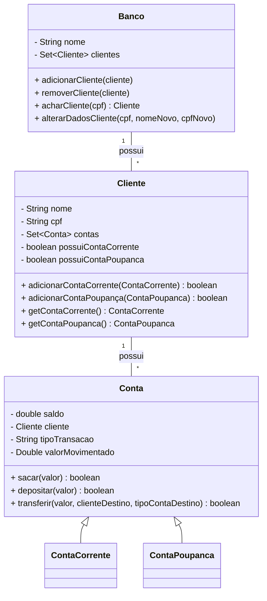

# DesafioBancoDigital

## 💡 Descrição

Este é um sistema bancário simples desenvolvido em **Java 21**, com o objetivo de consolidar conhecimentos fundamentais de **Programação Orientada a Objetos (POO)**, **tratamento de exceções**, **manipulação de arquivos** e **estrutura modular de pacotes**.

O sistema permite ao usuário:
- Cadastrar clientes
- Criar contas (corrente ou poupança)
- Realizar transações (depósito, saque, transferência)
- Gerar comprovantes automáticos na área de trabalho

---

## 🛠 Tecnologias e Ferramentas

- **Java SE 21**
- **JDK Collections API** (HashSet)
- **Java I/O (java.io)**: `BufferedWriter`, `FileWriter`, `File`
- **Scanner API** (leitura de entrada)
- **Exceções personalizadas**
- **Paradigmas de orientação a objetos**

---

## 🧠 Conceitos Java Aplicados

### ✅ Programação Orientada a Objetos
- **Encapsulamento**: Uso de `private` com getters/setters (ex: `Cliente`, `Conta`)
- **Herança**: `ContaCorrente` e `ContaPoupanca` herdam de `Conta`
- **Polimorfismo**: Métodos sobrescritos para operações específicas
- **Composição**: `Cliente` possui múltiplas contas (`ContaCorrente`, `ContaPoupanca`)
- **Abstração**: A classe `Conta` é abstrata

### ✅ Tratamento de Exceções
- Criação de uma classe `DomainException` que estende `RuntimeException`
- Validações de entrada e mensagens claras para o usuário

### ✅ Java Collections Framework
- Uso de `Set<Cliente>` e `Set<Conta>` com `HashSet` para garantir unicidade e eficiência
- Iterações com `for-each` para buscas dentro de coleções

### ✅ Java I/O
- Escrita de arquivos com `BufferedWriter` e `FileWriter` para geração de faturas
- Lógica de verificação para não sobrescrever arquivos existentes na área de trabalho

### ✅ Scanner e Fluxo de Entrada
- Utilização do `Scanner` para capturar e tratar entrada do usuário via terminal
- Cuidados com o uso de `nextLine()` após `nextInt()` para evitar bugs comuns

---

## 📦 Estrutura do Projeto

```bash
src/
├── application/
│   ├── BancoApp.java      
│   └── Main.java          
├── exceptions/
│   └── DomainException.java
├── model/
│   └── entities/
│       ├── Banco.java
│       ├── Cliente.java
│       ├── Conta.java        
│       ├── ContaCorrente.java
│       └── ContaPoupanca.java
│   └── services/
│       ├── FileService.java
│       └── TransferenciasService.java
```

---

## ▶️ Como Executar o Projeto

1. **Clone o repositório:**
   ```bash
   git clone https://github.com/seu-usuario/DesafioBancoDigital.git
   ```

2. **Abra o projeto no Eclipse**

3. **Execute a classe `Main.java`**

4. **Use o menu interativo no console para realizar operações bancárias**

---

## ✨ Funcionalidades

- [x] Cadastro de cliente
- [x] Criação de conta corrente e/ou poupança
- [x] Saque e depósito com validações
- [x] Transferência entre clientes
- [x] Geração automática de comprovante `.txt` na área de trabalho
- [x] Alteração de dados do cliente
- [x] Tratamento de exceções com mensagens claras
- [x] Validação de dados de entrada

---

## 🧬 Diagrama UML (Mermaid)




## 👤 Autor

**Wallace Candido Maia Sousa**  
Email: wallacemaia2007@gmail.com  

---
